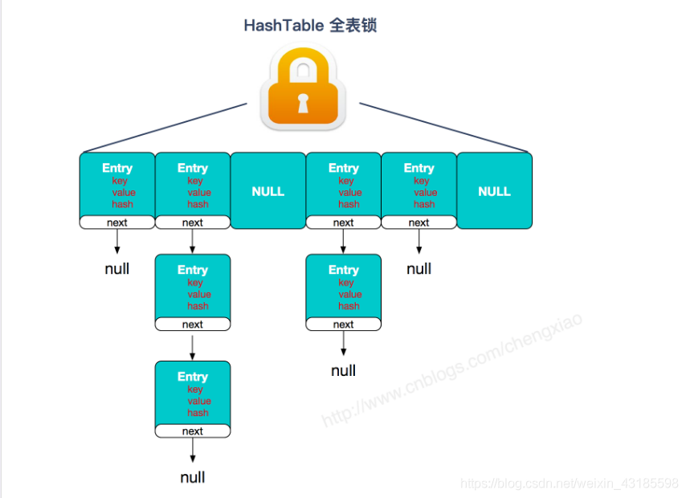
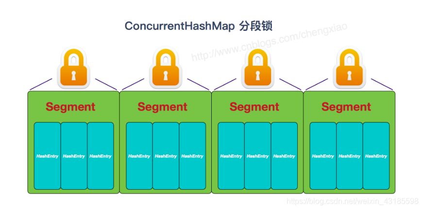
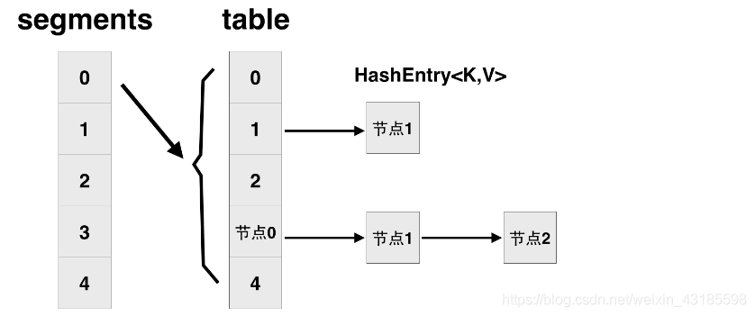
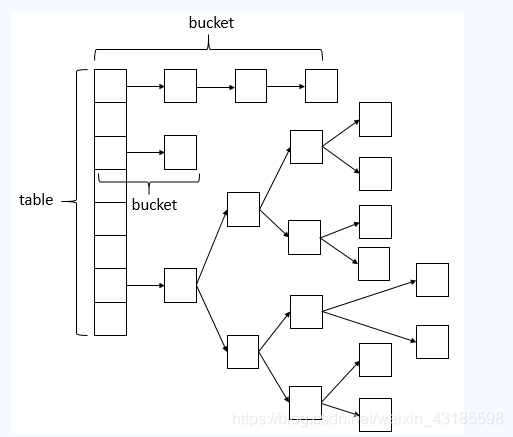

# ConcurrentHashMap

[ConcurrentHashMap实现原理及源码分析](https://blog.csdn.net/weixin_43185598/article/details/87938882)

## ConcurrentHashMap与HashMap，HashTable对比

### HashMap不是线程安全

在并发环境下，可能会形成环状链表（扩容时可能造成），导致get操作时，CPU空转，所以，在并发环境中使用HashMap是非常危险的。

### HashTable是线程安全的

* HashTable和HashMap实现原理几乎一样

  差别：HashTable不允许key和value为null

* HashTable是线程安全的

  

### ConcurrentHashMap

#### JDK7版本

分段锁

#### JDK8版本

* 取消segments字段，直接采用transient volatile HashEntry<K,V>[] table保存数据，采用table数组元素作为锁，从而实现了对每一行数据加锁，并发控制使用synchronized和CAS。
* 将原先table数组 + 单向链表的数据结构，变更为table数组 + 单向链表 + 红黑树的结构。

> 在ConcurrentHashMap中通过一个Node<K,V>[]数组来保存添加到map中的键值对，在同一个数组位置是通过链表或红黑树的形式保存的。但是这个数组只有在第一次添加元素的时候才会被初始化，否则只是初始化一个ConcurrentHashMap对象的话，只是设定了一个sizeCtl变量，这个变量用来判断对象的一些状态和是否需要扩容。

第一次添加原始的时候，默认初始化大小为16，当往map中继续添加元素的时候，通过hash值跟数组长度取模来决定在数组哪个位置，如果出现放在同一个位置的时候，优先以链表的形式存放，**在同一个位置的个数又达到8个以上，如果数组的长度还小于64的时候，则会扩容数组**。`如果数组的长度大于等于64了的话，则会在该节点链表转换成树`。

通过扩容数组的方式来把这些节点给分散开。然后将这些元素复制到扩容后的新的数组中，同一个链表中的元素通过hash值的数组长度位来区分。**扩容完成之后，如果某个节点是树，同时现在该节点的个数又小于等于6了，则会将树转为链表**。

