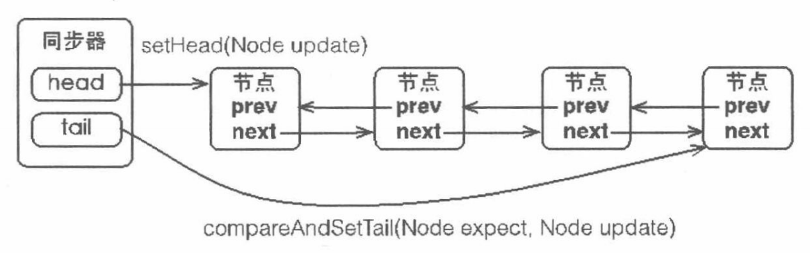
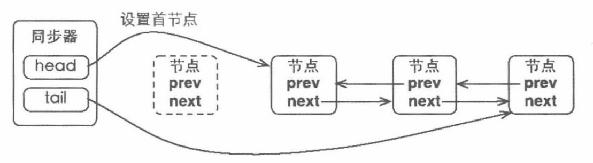
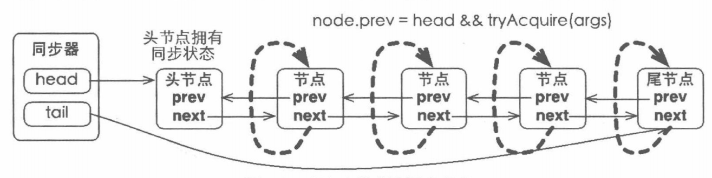

# AQS同步器

## 模板方法

基本上分为3类：

* 独占式获取与释放同步状态
* 共享式获取与释放同步状态
* 查询同步队列中的等待线程情况

## 同步队列

### 节点

用来保存获取同步状态失败的线程引用、等待状态以及前驱和后继节点。

* 等待状态 int waitStatus

  包含如下状态

  ①CANCELLED，值为1，由于在同步队列中等待的线程等待超时或者被中断，需要从同步队列中取消等待，节点进入该状态将不会变化

  ②SIGNAL，值-1，后继节点的线程处于等待状态，而当前节点的线程如果释放了同步状态或者被取消，将会通知后继节点，使后继节点的线程得以运行

  ③CONDITION，值-2，节点在等待队列中，节点线程等待在Condition上，当其他线程对Condition调用了signal()方法后，该节点将会从等待队列中转移到同步队列中，加入到同步状态的获取中

  ④PROPAGATE，值-3，表示下一次共享式同步状态获取将会无条件地被传播下去

  ⑤INITIAL，值为0，初始状态

* 前驱节点 Node prev

  当节点加入同步队列时被设置（尾部添加）

* 后继节点 Node next

* 等待队列中的后继节点 Node nextWaiter

  如果当前节点是共享的，那么这个字段将是一个SHARED常量，也就是说节点类型（独占或恭喜）和等待队列中的后继节点公用同一个字段

* 获取同步状态的线程 Thread thread

## 同步器结构

同步器拥有首节点和尾节点，没有成功获取同步状态的线程将会成为节点加入该队列的尾部。




AQS使用一个int成员变量来表示同步状态，通过内置的FIFO队列来完成获取资源线程的排队工作。AQS使用CAS对该同步状态进行原子操作实现对其值的修改。

```java
private volatile int state; // 共享变量，使用volatile修饰保证线程可见性
```

同步器包含了两个节点类型的引用，一个指向头节点，另一个指向尾节点。当一个线程成功地获取了同步状态或锁，其他线程将无法获取到同步状态，转而被构造成为节点并加入到同步队列中，而这个加入队列的过程必须要保证线程安全，因此同步器提供了一个基于CAS的设置尾节点的方法：compareAndSetTail(Node expect, Node update)，它需要传递当前线程“认为”的尾节点和当前节点，只有设置成功后，当前节点才正式与之前的尾节点建立关联。



同步队列遵循FIFO，首节点是获取同步状态成功的节点，首节点的线程在释放同步状态时，将会唤醒后继节点，而后继节点将会在获取同步状态成功时将自己设置为首节点。

设置头结点的方法并不需要使用CAS来保证，它只需要将首节点设置为原首节点的后继节点并断开原首节点的next引用即可。

### 独占式同步状态获取与释放

#### 同步状态获取

通过调用同步器的acquire(int arg)方法可以获取同步状态，该方法对中断不敏感，也就是由于线程获取同步状态失败后进入同步队列中，后续对线程进行中断操作时，线程不会从同步队列中移出。

```java
/**
 * 主要逻辑
 * 首先调用自定义同步器实现的tryAcquire(int arg)方法，该方法保证线程安全的获取同步状态，如果同步状态获取失败，则构造
 * 同步节点（独占式Node.EXCLUSIVE），并通过addWaiter(Node node)方法将该节点加入到同步队列的尾部，最后调用
 * acquireQueued(Node node, int arg)方法，使得该节点以“死循环”的方式获取同步状态。如果获取不到则阻塞节点中的线程，
 * 而被阻塞线程的唤醒主要依靠前驱节点的出队或阻塞线程被中断来实现
 */
public final void acquire(int arg) {
    if (!tryAcquire(arg) &&
       acquireQueued(addWaiter(Node.EXCLUSIVE), arg))
        selfInterrupt();
}
```

> 同步器的addWaiter和enq方法
>
> ```java
> private Node addWaiter(Node mode) {
>     Node node = new Node(Thread.currentThread(), mode);
>     // 快速尝试在尾部添加
>     Node pred = tail;
>     if (pred != null) {
>         node.prev = pred;
>         if (compareAndSetTail(pred, node)) {
>             pred.next = node;
>             return node;
>         }
>     }
>     enq(node);
>     return node;
> }
> 
> /**
>  * 同步器通过“死循环”来保证节点的正确添加，在“死循环”中只有通过CAS将节点设置成为尾节点之后，当前线程才能从该方法返回，
>  * 否则，当前线程不断地尝试设置。可以看出，enq(final Node node)方法将并发添加到节点的请求通过CAS变得“串行化”了
>  */
> private Node enq(final Node node) {
>     for(;;) {
>         Node t = tail;
>         if (t == null) {
>             if (compareAndSetHead(new Node())) {
>                 tail = head;
>             }
>         } else {
>             node.prev = t;
>             if (compareAndSetTail(t, node)) {
>                 t.next = node;
>                 return t;
>             }
>         }
>     }
> }
> ```

> 同步器的acquireQueued方法
>
> ```java
> /**
>  * 节点进入同步队列之后，就进入一个自旋的过程，每个节点（或者说每个线程）都在自省地观察，当条件满足，获取到了同步状态，
>  * 就可以从这个自旋过程中退出，否则依旧留在这个自旋过程中（并会阻塞节点的线程）
>  */
> final boolean acquireQueued(final Node node, int arg) {
>     boolean failed = true;
>     try {
>         boolean interrupted = false;
>         for (;;) {
>             final Node p = node.predecessor();
>             if (p == head && tryAcquire(arg)) {
>                 setHead(node);
>                 p.next = null; // help GC
>                 failed = false;
>                 return interrupted;
>             }
>             if (shouldParkAfterFailedAcquire(p, node) &&
>                parkAndCheckInterrupt()) {
>                 interrupted = true;
>             }
>         }
>     } finally {
>         if (failed) {
>             cancelAcquire(node);
>         }
>     }
> }
> ```
>
> 在acquireQueued(final Node node, int arg)方法中，当前线程在“死循环”中尝试获取同步状态，而只有前驱节点是头结点才能够获取同步状态，这是为什么？原因如下：
>
> * 1、头结点是成功获取到同步状态的节点，而头结点的线程释放了同步状态之后，将会唤醒其后继节点，后继节点的线程被唤醒后需要检查自己的前驱节点是否是头节点。
>
> * 2、维护同步队列的FIFO原则
>
>   
>
>   由于非首节点线程前驱节点出队或者被中断而从等待状态返回，随后检查自己的前驱是否是头结点，如果是则尝试获取同步状态。可以看到节点和节点之间在循环检查的过程中基本不相互通信，而是简单地判断自己的前驱是否为头结点，这样就使得节点的释放规则符合FIFO，并且也便于对过早通知的处理（过早通知是指前驱节点不是头结点的线程由于中断而被唤醒）。

#### 同步状态释放

当前线程获取同步状态并执行了相应逻辑之后，就需要释放同步状态，使得后续节点能够继续获取同步状态。通过调用同步器的release(int arg)方法可以释放同步状态，该方法在释放了同步状态之后，会唤醒其后继节点。

> 同步器的release方法
>
> ```java
> public final boolean release(int arg) {
>     if (tryRelease(arg)) {
>         Node h = head;
>         if (h != null && h.waitStatus != 0) {
>             // 该方法执行时，会唤醒头节点的后继节点线程，unparkSuccessor(Node node)方法使用LockSupport来唤醒
>             // 处于等待状态的线程
>             unparkSuccessor(h);
>         }
>         return true;
>     }
>     return false;
> }
> ```

#### 总结

**`在获取同步状态时，同步器维护一个同步队列，获取状态失败的线程都会被加入到队列中并在队列中进行自旋；移出队列的条件是前驱节点为头节点且成功获取了同步状态。在释放同步状态时，同步器调用tryRelease(int arg)方法释放同步状态，然后唤醒头节点的后继节点。`**

### 共享式同步状态获取与释放

#### 状态获取

共享式访问资源时，其他共享式访问均被允许，而独占式访问被阻塞；独占式访问资源时，同一时刻其他访问均被阻塞。

> 同步器acquireShared和doAcquireShared方法
>
> ```java
> public final void acquireShared(int arg) {
>  if (tryAcquireShared(arg) < 0) {
>      doAcquireShared(arg);
>  }
> }
> 
> private void doAcquireShared(int arg) {
>  final Node node = addWaiter(Node.SHARED);
>  boolean failed = true;
>  try {
>      boolean interrupted = false;
>      for (;;) {
>          final Node p = node.predecessor();
>          if (p == head) {
>              int r = tryAcquireShared(arg);
>              if (r >= 0) {
>                  setHeadAndPropagate(node, r);
>                  p.next = null;
>                  if (interrupted) {
>                      selfInterrupt();
>                  }
>                  failed = false;
>                  return;
>              }
>          }
>          if (shouldParkAfterFailedAcuire(p, node) &&
>             parkAndCheckInterrupt()) {
>              interrupted = true;
>          }
>      }
>  } finally {
>      if (failed) {
>          cancelAcquire(node);
>      }
>  }
> }
> ```
>
> 在acquireShared(int arg)方法中，同步器调用tryAcquireShared(int arg)方法尝试获取同步状态，tryAcquireShared(int arg)方法返回值为int类型，当返回值大于等于0时，表示能够获取到同步状态。在doAcquireShared(int arg)方法的自旋过程中，如果当前节点的前驱为头节点时，尝试获取同步状态，如果返回值大于等于0，表示盖茨获取同步状态成功并从自旋过程中退出。

#### 状态释放

> ```java
> public final boolean releaseShared(int arg) {
>     if (tryReleaseShared(arg)) {
>         doReleaseShared();
>         return true;
>     }
>     return false;
> }
> ```
>
> 该方法在释放同步状态之后，将会唤醒后续处于等待状态的节点。

## 资源共享方式

* `Exclusive（独占）`只有一个线程能执行，如ReentrantLock，又分为公平锁和非公平锁：
  * 公平锁：按照线程在队列中的排队顺序，先到者先拿到锁；
  * 非公平锁：当线程要获取锁时，无视队列顺序直接去抢，谁抢到就是谁的
* `Share（共享）`多个线程可同时执行，如Semaphore、CountDownLatch，CyclicBarrier、ReentrantReadWriteLock。

## AQS模板方法

```java
isHeldExclusively(); // 该线程是否正在独占资源，只有用到condition才需要去实现它
tryAcquire(int); // 独占方式。尝试获取资源，成功则返回true，失败则返回false
tryRelease(int); // 独占方式，尝试释放资源，成功返回true，失败返回false
tryAcquireShared(int); // 共享方式，尝试获取资源。负数表示失败，0表示成功，但没有剩余可用资源；正数表示成功，且有剩余资源
tryReleaseShared(int); // 共享方式，尝试释放资源，成功返回true，失败返回false
```

## ReentrantLock

### 实现重进入

重进入是指任意线程在获取到锁之后能够再次获取该锁而不会被锁所阻塞，该特性实现需要解决以下两个问题

* 1）线程再次获取锁。锁需要去识别获取锁的线程是否为当前占据锁的线程，如果是，则再次成功获取；
* 2）锁的最终释放，线程重复n次获取了锁，随后在第n次释放该锁后，其他线程能够获取到该锁。锁的最终释放要求锁对于获取进行计数自增，计数表示当前锁被重复获取的次数，而锁被释放时，计数自减，当计数等于0是表示锁已经成功释放。

> ReentrantLock的nonfairTryAcquire方法
>
> ```java
> final boolean nonfairTryAcquire(int acquires) {
>     final Thread current = Thread.currentThread();
>     int c = getState();
>     if (c == 0) {
>         if (compareAndSetState(0, acquires)) {
>             setExclusiveOwnerThread(current);
>             return true;
>         }
>     } else if (current == getExclusiveOwnerThread()) {
>         int nextc = c + acquires;
>         if (nextc < 0) {
>             throw new Error("Maximum lock count exceeded");
>         }
>         setState(nextc);
>         return true;
>     }
>     return false;
> }
> ```
>
> 该方法增加了再次获取同步状态的处理逻辑：通过判断当前线程是否为获取锁的线程来决定获取操作是否成功，如果获取锁的线程再次请求，则将同步状态值进行增加并返回true，表示获取同步状态成功。
>
> 成功获取锁的线程再次获取锁，只是增加了同步状态值，这也要求ReentrantLock在释放同步状态时减少同步状态值。
>
> ```java
> protected final boolean tryRelease(int releases) {
>     int c = getState() - releases;
>     if (Thread.currentThread() != getExclusiveOwnerThread()) {
>         throw new IllegalMonitorStateException();
>     }
>     boolean free = false;
>     if (c == 0) {
>         free = true;
>         setExclusiveOwnerThread(null);
>     }
>     setState(c);
>     return free;
> }
> ```

#### 公平锁

> 公平锁ReentrantLock的tryAcquire方法
>
> ```java
> final boolean nonfairTryAcquire(int acquires) {
>     final Thread current = Thread.currentThread();
>     int c = getState();
>     if (c == 0) {
>         if (!hasQueuedPredecessors() && compareAndSetState(0, acquires)) {
>             setExclusiveOwnerThread(current);
>             return true;
>         }
>     } else if (current == getExclusiveOwnerThread()) {
>         int nextc = c + acquires;
>         if (nextc < 0) {
>             throw new Error("Maximum lock count exceeded");
>         }
>         setState(nextc);
>         return true;
>     }
>     return false;
> }
> ```
>
> 该方法与nonfairTryAcquire(int acquires)比较，唯一不同的位置为判断条件多了hasQueuedPredecessors()方法，即加入了同步队列中当前节点是否有前驱节点的判断，如果该方法返回true，则表示有线程比当前线程更早地请求获取锁，因此需要等待前驱线程获取并释放锁之后才能继续获取锁。

### 释放锁过程

* 1）外界调用`unlock`方法时，实际上会调用AQS的`release`方法，而`release`方法又会调用`ReentrantLock.tryRelease()`方法。
* 2）tryRelease会把state一直减（锁重入state>1），直至到0，说明当前线程已经把锁释放了。
* 3）随后从队尾往前找节点状态需要<0，并离头节点最近的节点进行唤醒。唤醒之后，被唤醒的线程则尝试使用CAS获取锁，假设获取锁得到锁，则把头节点给干掉，把自己设置为头节点。

#### 解释

Node节点的状态有4种，分别是CANCELLED(1)、SIGNAL(-1)、CONDITION(-2)、PROPAGATE(-3)和0

在ReentrantLock解锁的时候，会判断节点的状态是否小于0，小于等于0才说明需要被唤醒。

#### 公平锁

公平锁在获取锁的时候，不会直接尝试CAS获取锁，只有当队列没有节点而且state状态为0才会直接获取锁，不然就会乖乖的加入到队列中。

