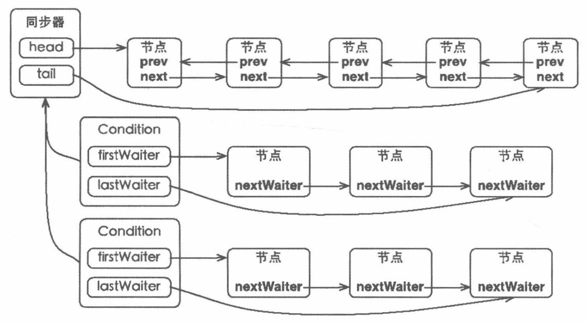

# Condition

ConditionObject是同步器AbstractQueuedSynchronizer的内部类，因为Condition的操作需要获取相关联的锁，所以作为同步器的内部类也较为合理。每个Condition对象都包含着一个队列（等待队列），该队列是Condition对象实现等待、通知功能的关键。

## 等待队列

等待队列是一个FIFO的队列，在队列中的每个节点都包含一个线程引用，该线程就是在Condition对象上等待的线程，如果一个线程调用了Condition.await()方法，那么该线程将会释放锁、构建成节点加入等待队列并进入等待状态。事实上，节点的定义服用了同步器中节点的定义，也就是说，同步队列和等待队列中节点类型都是同步器的静态内部类AbstractQueuedSynchronizerNode。

一个Condition包含一个等待队列，Condition拥有首节点和尾节点。当前线程调用Condition.await()方法，将会以当前线程构造节点，并将该节点从尾部加入等待队列。

Condition拥有首尾节点的引用，而新增节点只需要将原有的尾节点nextWaiter指向它，并且更新尾节点即可。上述节点引用更新的过程并没有使用CAS保证，原因在于调用await()方法的线程必定是获取了锁的线程，也就是说该过程是有锁来保证线程安全的。

Lock可以用一个同步队列和多个等待队列。

Condition的实现是同步器的内部类，因此每个Condition实例都能够访问同步器提供的方法，相当于每个Condition都拥有所属同步器的引用。

## 等待

调用Condition的await()方法，会使当前线程进入等待队列并释放锁，同时线程状态变为等待状态。当从await()方法返回时，当前线程一定获取了Condition相关联的锁。

如果从队列的角度看await()方法，当调用await()方法时，相当于同步队列的首节点（获取了锁的节点）移动到Condition的等待队列中。调用await()方法的线程成功获取了锁的线程，也就是同步队列的首节点，该方法会将当前线程构成节点并加入等待队列中，然后释放同步状态，唤醒同步队列中的后继节点，然后当前线程会进入等待状态。

当等待队列中的节点被唤醒，则唤醒节点的线程开始尝试获取同步状态。如果不是通过其他线程调用Condition.singal()方法唤醒，而是对等待线程进行中断，则会抛出InterruptedException。

**同步队列的首节点并不会直接加入等待队列，而是通过addConditionWaiter()方法把当前线程构造成一个新的节点并将其加入等待队列中。**

## 通知

调用Condition的signal()方法，将会唤醒在等待队列中等待时间最长的节点（首节点），在唤醒节点之前，会将节点移到同步队列中。

调用该方法的前置条件是当前线程必须获取了锁，可以看到signal()方法进行了isHeldExclusively()检查，也就是当前线程必须是获取了锁的线程。接着获取等待队列的首节点，将其移动到同步队列并使用LockSupport唤醒节点中的线程。

通过调用同步器的enq(Node node)方法，等待队列中的头结点线程安全地移动到同步队列。当节点移动到同步队列后，当前线程再使用LockSupport唤醒该节点的线程。

被唤醒后的线程，将从await()方法中的while循环中退出，进而调用同步器的acquireQueued()方法加入到获取同步状态的竞争中。

成功获取同步状态之后，被唤醒的线程将从先前调用await()方法返回，此时该线程已经成功的获取了锁。

Condition的signalAll()方法，相当于对等待队列中的每个节点均执行一次signal()方法，效果就是将等待队列中的所有节点全部移动到同步队列中，并唤醒每个节点的线程。