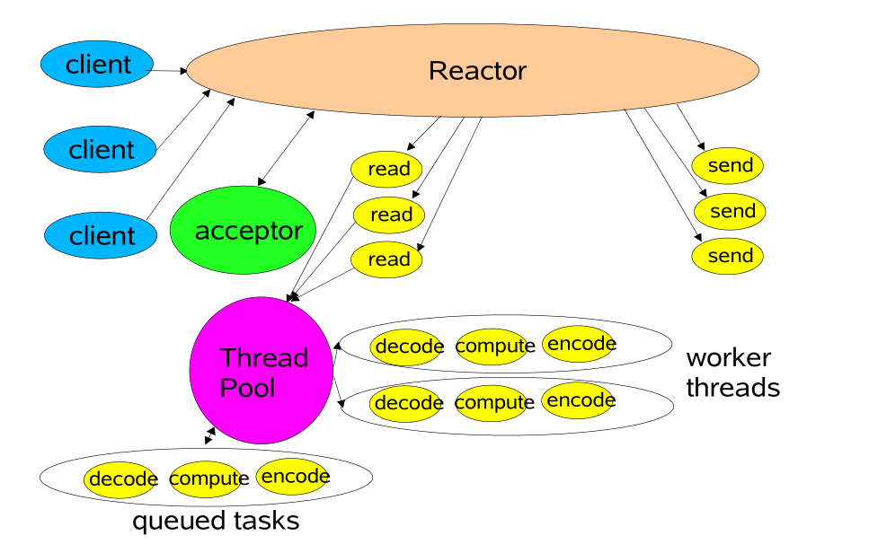
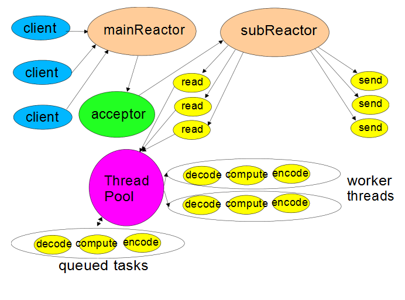

# Scalable IO in Java

[Scalable IO in Java中文讲解](https://www.cnblogs.com/dafanjoy/p/11217708.html)

## 网络服务

> 一般网络或分布式服务等应用中，大都具备一些相同的处理流程：
>
> * 1、读取请求数据；
> * 2、对请求数据进行解码；
> * 3、对数据进行处理；
> * 4、对回复数据进行编码；
> * 5、发送回复

### 传统服务设计模式

在一般的网络服务当中都会为每一个连接处理开启一个新的线程


```java
class Server implements Runnable {
    public void run() {
        
    }
    
    static class Handler implements Runnable {
        final Socket socket;
        
        Handler(Socket s) {
            socket = s;
        }
        
        @Override
        public void run() {
            try {
                byte[] input = new byte[MAX_INPUT];
                socket.getInputStream().read(input);
                byte[] output = process(input);
                socket.getOutputStream().write(output);
            } catch (IOException ex) {}
        }
        
        private byte[] process(byte[] cmd) {}
    }
}
```

### Reactor模式

#### 单线程模式


* Channels

  支持非阻塞读写的socket连接

* Buffers

  用于被Channels读写的字节数组对象

* Selectors

  用于判断channel发送IO事件的选择器

* SelectionKeys

  负责IO事件的状态与绑定

```java
// 第一步 Reactor线程初始化
class Reactor implements Runnable {
    final Selector selector;
    final ServerSocketChannel serverSocket;
    
    Reactor(int port) throws IOException {
        selector = Selector.open();
        serverSocket = ServerSocketChannel.open();
        serverSocket.socket().bind(new InetSocketAddress(port));
        serverSocket.configureBlocking(false); // 非阻塞
        SelectionKey sk = serverSocket.register(selector, SelectionKey.OP_ACCEPT); // 注册accept事件
        sk.attach(new Acceptor()); // 调用Acceptor()为回调方法
    }
    
    @Override
    public void run() {
        try {
            while (!Thread.interrupted()) { // 循环
                selector.select();
                Set selected = selector.selectedKeys();
                Iterator it = selected.iterator();
                
                while (it.hasNext()) {
                    dispatch((SelectionKey) (it.next)); // dispatch分发事件
                }
                
                selected.clear();
            }
        } catch (IOException ex) {
            
        }
    }
    
    void dispatch(SelectionKey k) {
        Runnable r = (Runnable) (k.attachment()); // 调用SelectionKey绑定的调用对象
        if (null != r) {
            r.run();
        }
    }
    
    class Acceptor implements Runnable {
        
        @Override
        public void run() {
            try {
                SocketChannel c = serverSocket.accept();
                if (null != c) {
                    new Handler(selector, c);
                }
            } catch (IOException ex) {}
        }
    }
}

// 第二步 Handler处理类的初始化
final class Handler implements Runnable {
    final SocketChannel socket;
    final SelectionKey sk;
    ByteBuffer input = ByteBuffer.allocate(MAXIN);
    ByteBuffer output = ByteBuffer.allocate(MAXOUT);
    static final int READING = 0, SENDING = 1;
    int state = READING;
    
    Handler(Selector sel, SocketChannel c) throws IOException {
        socket = c;
        c.configureBlocking(false);
        sk = socket.register(sel, 0);
        sk.attach(this);
        sk.interestOps(SelectionKey.OP_READ); // 将Handler绑定到SelectionKey上
        sel.wakeup();
    }
    
    boolean inputIsComplete(){}
    
    boolean outputIsComplete(){}
    
    void process(){}
    
    @Override
    public void run() {
        try {
            if (READING == state) read();
            else if (SENDING == state) send();
        } catch (IOException ex) {}
    }
    
    void read() throws IOException {
        socket.read(input);
        if (inputIsComplete()) {
            process();
            state = SENDING;
            sk.interestOps(SelectionKey.OP_WRITE);
        }
    }
    
    void send() throws IOException {
        socket.write(output);
        if (outputIsComplete()) sk.cancel();
    }
}
```

#### 多线程设计模式

##### 多线程模式

> Reactor多线程设计模式具备以下几个特点：
>
> * 1、通过移除非IO操作来提升Reactor线程的处理性能；
> * 2、将非IO操作重新设计为事件驱动的方式更简单；
> * 3、最好能在第一时间将所有输入读到缓冲区（最好一次性读取缓冲区数据，方便异步非IO操作处理数据）；
> * 4、可以通过线程池的方式对线程进行调优与控制，一般情况下需要的线程数量比客户端数量少很多；



```java
class Handler implements Runnable {
    static PooledExecutor pool = new PooledExecutor(...); // 声明线程池
    static final int PROCESSING = 3;
    
    synchronized void read() {
        socket.read(input);
        
        if (inputIsComplete()) {
            state = PROCESSING;
            pool.execute(new Processer()); // 处理程序放在线程池中执行
        }
    }
    
    synchronized void processAndHandOff() {
        process();
        state = SENDING;
        sk.interest(SelectionKey.OP_WRITE);
    }
    
    class Processer implements Runnable {
        @Override
        public void run() {
            processAndHandOff();
        }
    }
}
```

##### 基于多个反应器的多线程模式



这是对上面模式的进一步完善，使用反应器线程池，一方面根据实际情况用于匹配调节CPU处理与IO读写的效率，提高系统资源的利用率，另一方面在静态或动态构造中每个反应器线程都包含对应的Selector，Thread，dispatchloop，（Netty是基于这个模式设计的，一个处理Accept连接的mainReactor线程，多个处理IO事件的subReactor线程）

```java
Selector[] selectors; // Selector集合，每一个Selector对应一个subReactor线程
// mainReactor线程
class Acceptor {
    public synchronized void run() {
        // ...
        Socket connection = serverSocket.accept();
        if (null != connection) {
            new Handler(selectors[next], connection);
        }
        
        if (++next == selectors.length) {
            next = 0;
        }
    }
}
```

